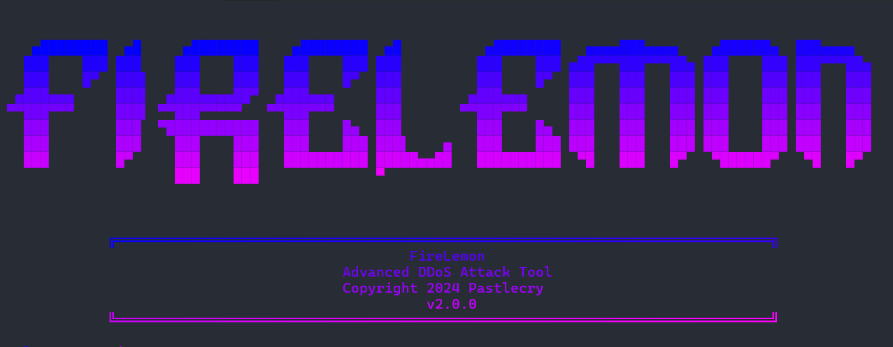

 

  <h3 align="center">FireLemon</h3>

  

    Advanced DDoS Attack Tool
  

  

FireLemon is an Advanced DDoS Tool Powered by Python's most Powerful Frameworks such as Scapy, Requests, Socket and PySocks.
 

  

This DDoS Script supports:
+ Layer 3
+ Layer 4
+ Layer 6

Copyright 2024 Pastlecry 

Lemonade Tool v2.0.0

> [!WARNING]
> This repositpry's Author is not resposible for what you're about to do with this script.

> [!WARNING]
> This script made for Educational purposes only!
# License
all files are Licensed under [MIT](/LICENSE) License 
